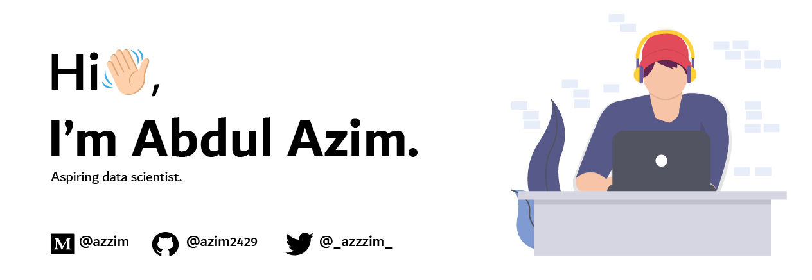

#
- 🔭 I’m currently working on **Exploring Data**

- 👯 I’m looking to collaborate on **Open Source projects**

- 📝 I regulary write articles on [Medium](azzim.medium.com)

- 💬 Ask me about **Flutter, Dart and Open source**

- 🌱 I’m currently learning **Data Science**

- 📫 Contact me at **abdulazim0402@gmail.com**

<!--- ⚡ Fun fact ****-->

<!---->
<!--[Top Languages](https://github-readme-stats.vercel.app/api/top-langs/?username=azim2429&layout=compact&theme=tokyonight&show_icons=true)-->
###

<!---->

  
   
<!--     -->
   
<!--    -->
  

